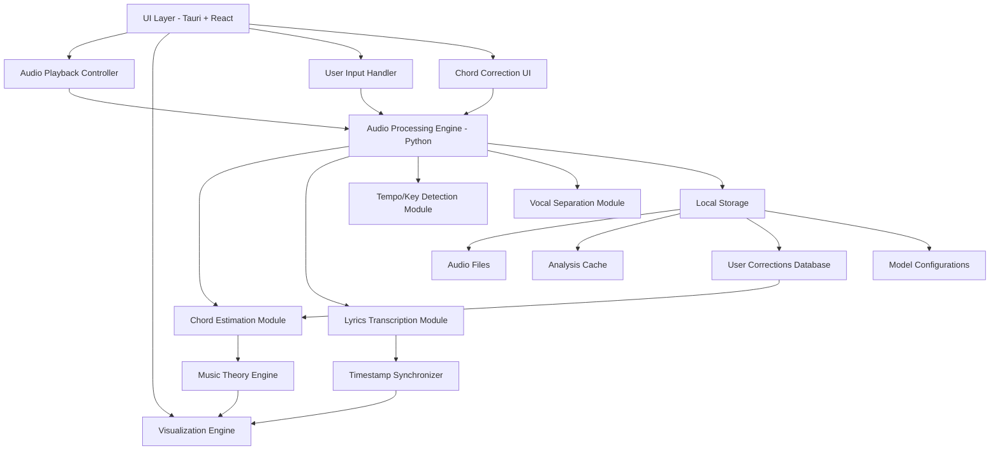
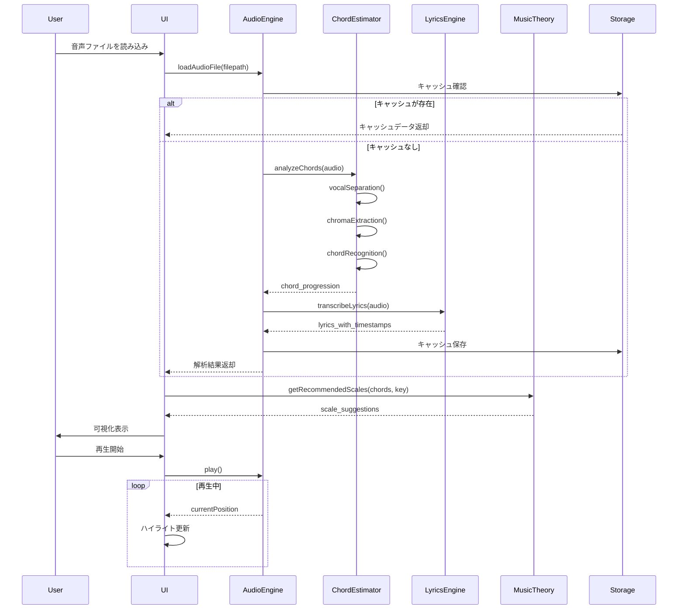

# 設計ドキュメント: chord-analysis-tool

## 概要

chord-analysis-toolは、音声ファイルからコード進行を自動推定し、演奏者の練習とアドリブをサポートするローカル完結型のデスクトップアプリケーションです。本ツールは、音声解析技術（コード推定、テンポ検出、キー検出）、自然言語処理（Whisperによる歌詞書き起こし）、音楽理論（スケール推奨）を統合し、リアルタイムで同期された視覚的なインターフェースを提供します。

主要な技術的アプローチとして、音声信号処理パイプライン（ボーカル除去 → クロマ特徴抽出 → 深層学習ベースのコード推定）、タイムスタンプ同期エンジン、音楽理論エンジン（コード-スケールマッピング）を採用します。精度チューニングについては、ユーザーによる手動コード修正機能、修正データの蓄積と分析、複数モデルの切り替え機能を通じて汎用性を確保します。

アーキテクチャは、UI層（Tauri + React）、ビジネスロジック層（Python音声処理エンジン）、データ層（ローカルストレージ）の3層構造を採用し、プラットフォーム間の移植性と保守性を重視します。

## 技術スタック

### フロントエンド
- **フレームワーク**: Tauri 2.x（参考アプリと同様）
- **UI**: React 19.x
- **Tauriプラグイン**: 
  - @tauri-apps/plugin-dialog（ファイル選択）
  - @tauri-apps/plugin-fs（ファイルシステムアクセス）
  - @tauri-apps/plugin-opener（外部リンク）

### バックエンド（Python音声処理エンジン）
- **音声処理**: librosa 0.11.0（参考アプリと同バージョン）
- **機械学習**: 
  - tensorflow-cpu 2.13.0（参考アプリと同バージョン）
  - onnxruntime 1.24.1（モデル推論の高速化）
  - scikit-learn 1.8.0（特徴量処理）
- **歌詞書き起こし**: openai-whisper（最新安定版）
- **ボーカル分離**: demucs（Meta製、高精度）
- **数値計算**: numpy 1.24.3, scipy 1.11.4

### データストレージ
- **キャッシュ**: JSON形式（解析結果）
- **ユーザー修正データ**: JSON形式（コード修正履歴）
- **設定**: TOML形式

## アーキテクチャ



## 主要なワークフロー



## コンポーネントとインターフェース

### Component 1: AudioProcessingEngine

**目的**: 音声ファイルの読み込み、解析、再生制御を統括する中核エンジン

**インターフェース**:
```python
from typing import Optional, List, Tuple
from dataclasses import dataclass
from pathlib import Path

@dataclass
class AudioAnalysisResult:
    chord_progression: List[ChordSegment]
    lyrics: List[LyricSegment]
    tempo: float
    key: str
    time_signature: Tuple[int, int]

class AudioProcessingEngine:
    def load_audio_file(self, filepath: Path) -> bool:
        """音声ファイルを読み込み、基本情報を取得"""
        pass
    
    def analyze_audio(self, use_cache: bool = True) -> AudioAnalysisResult:
        """音声の完全解析を実行（コード、歌詞、テンポ、キー）"""
        pass
    
    def play(self) -> None:
        """音声再生を開始"""
        pass
    
    def pause(self) -> None:
        """音声再生を一時停止"""
        pass
    
    def stop(self) -> None:
        """音声再生を停止"""
        pass
    
    def seek(self, position_seconds: float) -> None:
        """再生位置を変更"""
        pass
    
    def set_volume(self, volume: float) -> None:
        """音量を設定（0.0 - 1.0）"""
        pass
    
    def get_current_position(self) -> float:
        """現在の再生位置を秒単位で取得"""
        pass
```

**責務**:
- 音声ファイルのロードと検証
- 各解析モジュールの調整
- 再生制御とタイムライン管理
- キャッシュ管理


### Component 2: ChordEstimationModule

**目的**: 音声信号からコード進行を推定

**インターフェース**:
```python
from enum import Enum
from typing import Optional

class ChordQuality(Enum):
    MAJOR = "maj"
    MINOR = "min"
    DOMINANT7 = "7"
    MAJOR7 = "maj7"
    MINOR7 = "min7"
    DIMINISHED = "dim"
    AUGMENTED = "aug"
    SUS4 = "sus4"
    SUS2 = "sus2"
    NINTH = "9"
    ELEVENTH = "11"
    THIRTEENTH = "13"

@dataclass
class ChordSegment:
    start_time: float
    end_time: float
    root: str  # "C", "D", "E", etc.
    quality: ChordQuality
    bass_note: Optional[str] = None  # 分数コード用
    extensions: List[str] = None  # 9th, 11th, 13thなど
    confidence: float = 0.0

class ChordEstimationModule:
    def __init__(self, model_path: Optional[Path] = None):
        """コード推定モデルを初期化"""
        pass
    
    def estimate_chords(
        self, 
        audio: np.ndarray, 
        sample_rate: int,
        use_vocal_separation: bool = True
    ) -> List[ChordSegment]:
        """音声からコード進行を推定"""
        pass
    
    def separate_vocals(self, audio: np.ndarray, sample_rate: int) -> np.ndarray:
        """ボーカルを除去し、伴奏のみを抽出"""
        pass
    
    def extract_chroma(self, audio: np.ndarray, sample_rate: int) -> np.ndarray:
        """クロマ特徴量を抽出"""
        pass
    
    def detect_bass_notes(self, audio: np.ndarray, sample_rate: int) -> List[Tuple[float, str]]:
        """ベース音を検出（分数コード判定用）"""
        pass
```

**責務**:
- ボーカル分離処理
- クロマ特徴量抽出
- HMM/深層学習モデルによるコード認識
- 分数コード検出
- 拡張音（9th, 11th, 13th）の推定


### Component 3: LyricsTranscriptionModule

**目的**: Whisperを使用した歌詞の自動書き起こしとタイムスタンプ取得

**インターフェース**:
```python
@dataclass
class LyricSegment:
    start_time: float
    end_time: float
    text: str
    confidence: float

class LyricsTranscriptionModule:
    def __init__(self, model_size: str = "base"):
        """Whisperモデルを初期化（tiny, base, small, medium, large）"""
        pass
    
    def transcribe(
        self, 
        audio: np.ndarray, 
        sample_rate: int,
        language: str = "ja"
    ) -> List[LyricSegment]:
        """音声から歌詞とタイムスタンプを取得"""
        pass
    
    def align_lyrics_with_chords(
        self, 
        lyrics: List[LyricSegment], 
        chords: List[ChordSegment]
    ) -> List[Tuple[LyricSegment, List[ChordSegment]]]:
        """歌詞とコードを同期"""
        pass
```

**責務**:
- Whisperによる音声認識
- タイムスタンプ付き歌詞の生成
- 歌詞とコードの時間軸同期


### Component 4: ChordCorrectionModule

**目的**: ユーザーによるコード修正の管理と精度改善のためのデータ蓄積

**インターフェース**:
```python
@dataclass
class ChordCorrection:
    audio_file_hash: str
    segment_index: int
    original_chord: ChordSegment
    corrected_chord: ChordSegment
    timestamp: datetime
    user_id: Optional[str] = None

class ChordCorrectionModule:
    def __init__(self, corrections_db_path: Path):
        """コード修正データベースを初期化"""
        pass
    
    def save_correction(
        self, 
        audio_file: Path,
        segment_index: int,
        original: ChordSegment,
        corrected: ChordSegment
    ) -> None:
        """ユーザーのコード修正を保存"""
        pass
    
    def get_corrections_for_file(self, audio_file: Path) -> List[ChordCorrection]:
        """特定の音声ファイルの修正履歴を取得"""
        pass
    
    def apply_corrections(
        self, 
        audio_file: Path,
        chord_progression: List[ChordSegment]
    ) -> List[ChordSegment]:
        """保存された修正をコード進行に適用"""
        pass
    
    def export_corrections_dataset(self, output_path: Path) -> None:
        """修正データをモデル再学習用にエクスポート"""
        pass
    
    def get_correction_statistics(self) -> Dict[str, Any]:
        """修正統計情報を取得（最も修正されるコード品質など）"""
        pass
```

**責務**:
- ユーザーのコード修正の保存
- 修正履歴の管理
- 修正データの統計分析
- モデル再学習用データセットの生成


### Component 5: ModelConfigurationModule

**目的**: 複数のコード推定モデルの管理と切り替え

**インターフェース**:
```python
@dataclass
class ModelConfig:
    model_id: str
    model_name: str
    model_path: Path
    model_type: str  # "tensorflow", "onnx", "pytorch"
    description: str
    accuracy_metrics: Dict[str, float]
    is_default: bool = False

class ModelConfigurationModule:
    def __init__(self, models_dir: Path):
        """モデル設定を初期化"""
        pass
    
    def list_available_models(self) -> List[ModelConfig]:
        """利用可能なモデルのリストを取得"""
        pass
    
    def get_active_model(self) -> ModelConfig:
        """現在アクティブなモデルを取得"""
        pass
    
    def set_active_model(self, model_id: str) -> None:
        """アクティブなモデルを変更"""
        pass
    
    def add_custom_model(
        self, 
        model_path: Path,
        model_name: str,
        model_type: str,
        description: str
    ) -> ModelConfig:
        """カスタムモデルを追加"""
        pass
    
    def evaluate_model(
        self, 
        model_id: str,
        test_audio_files: List[Path],
        ground_truth: List[List[ChordSegment]]
    ) -> Dict[str, float]:
        """モデルの精度を評価"""
        pass
```

**責務**:
- 複数モデルの管理
- モデルの切り替え
- カスタムモデルの追加
- モデル精度の評価


## コード推定精度改善戦略

### 1. ユーザーフィードバックループ

**アプローチ**:
- ユーザーが推定結果を手動で修正できるUI機能を提供
- 修正データを構造化して保存（音声ファイルハッシュ、セグメント位置、元のコード、修正後のコード）
- 修正データを分析し、モデルの弱点を特定

**実装**:
```python
# 修正データの保存例
correction = ChordCorrection(
    audio_file_hash="abc123...",
    segment_index=5,
    original_chord=ChordSegment(10.0, 12.0, "C", ChordQuality.MAJOR, confidence=0.6),
    corrected_chord=ChordSegment(10.0, 12.0, "Dm", ChordQuality.MINOR, confidence=1.0),
    timestamp=datetime.now()
)
```

### 2. 複数モデルの切り替え

**アプローチ**:
- デフォルトモデル（TensorFlow/ONNX）
- 軽量モデル（高速処理用）
- 高精度モデル（処理時間は長いが精度重視）
- ユーザーがジャンルや用途に応じてモデルを選択可能

**実装**:
```python
# モデル切り替え例
model_config = ModelConfigurationModule(models_dir=Path("./models"))
model_config.set_active_model("high_accuracy_jazz_model")
```

### 3. 修正データの統計分析

**アプローチ**:
- 最も修正されるコード品質を特定（例: 7thコードがmaj7と誤認識される）
- 特定の音域やテンポでの誤認識パターンを分析
- ジャンル別の精度を測定

**実装**:
```python
# 統計情報の取得例
stats = correction_module.get_correction_statistics()
# {
#   "most_corrected_quality": "DOMINANT7",
#   "avg_confidence_before_correction": 0.65,
#   "total_corrections": 150,
#   "correction_rate_by_genre": {"jazz": 0.25, "pop": 0.15}
# }
```

### 4. モデル再学習のためのデータセット生成

**アプローチ**:
- 蓄積された修正データをトレーニングデータセットとしてエクスポート
- 音声特徴量（クロマ、MFCC）と正解コードのペアを生成
- 外部ツールでモデルを再学習し、精度向上

**実装**:
```python
# データセットエクスポート例
correction_module.export_corrections_dataset(
    output_path=Path("./training_data/corrections_dataset.json")
)
```

### 5. 信頼度スコアの活用

**アプローチ**:
- 低信頼度のコードセグメントをUIで強調表示
- ユーザーに優先的に確認を促す
- 信頼度閾値を設定し、自動的に代替候補を提示

**実装**:
```python
# 低信頼度セグメントのフィルタリング例
low_confidence_chords = [
    chord for chord in chord_progression 
    if chord.confidence < 0.7
]
```


## 正確性プロパティ

*プロパティとは、システムの全ての有効な実行において真であるべき特性や振る舞いのことです。本質的には、システムが何をすべきかについての形式的な記述です。プロパティは、人間が読める仕様と機械で検証可能な正確性保証の橋渡しとなります。*

### プロパティ1: 有効な音声ファイルの読み込み成功

*任意の*有効な音声ファイルパスに対して、AudioEngineはファイルを正常に読み込み、基本情報（サンプルレート、長さ、チャンネル数）を返すべきである

**検証対象: 要件1.1、1.4**

### プロパティ2: 無効な入力に対するエラーハンドリング

*任意の*無効な音声ファイルパス、またはサポートされていない音声フォーマットに対して、AudioEngineはエラーを返し、システム状態を変更しないべきである

**検証対象: 要件1.2、1.3**

### プロパティ3: コード推定の完全性

*任意の*音声データに対して、ChordEstimatorはコード進行のリストを返し、各コードセグメントには開始時刻、終了時刻、ルート音、コード品質、信頼度スコアが含まれるべきである

**検証対象: 要件2.1、2.3、2.4、2.5**

### プロパティ4: オプショナルコード情報の条件付き包含

*任意の*コードセグメントに対して、分数コードが検出された場合はベース音情報が含まれ、拡張音（9th、11th、13th）が検出された場合は拡張音情報が含まれるべきである

**検証対象: 要件2.6、2.7**

### プロパティ5: ボーカル分離のサンプルレート不変性

*任意の*音声データに対して、ボーカル分離処理を実行した後も、元の音声データのサンプルレートが保持されるべきである

**検証対象: 要件3.2**

### プロパティ6: クロマ特徴量の次元性

*任意の*音声データに対して、抽出されたクロマ特徴量は12次元のベクトルの時系列であるべきである

**検証対象: 要件4.2**

### プロパティ7: 歌詞書き起こしの完全性

*任意の*音声データに対して、LyricsEngineはタイムスタンプ付き歌詞セグメントのリストを返し、各セグメントには開始時刻、終了時刻、テキスト、信頼度スコアが含まれるべきである

**検証対象: 要件5.1、5.2、5.3**

### プロパティ8: 歌詞とコードの時間同期

*任意の*歌詞セグメントとコードセグメントのペアに対して、時間範囲が重なる場合は関連付けられ、重ならない場合は空のコードリストが関連付けられるべきである

**検証対象: 要件6.2、6.3**

### プロパティ9: 再生位置の正確性

*任意の*シーク位置に対して、AudioEngineは指定された位置に再生位置を変更し、get_current_position()で同じ位置を返すべきである。また、一時停止時には現在位置が保持され、停止時には位置が0にリセットされるべきである

**検証対象: 要件7.2、7.3、7.4、7.6**

### プロパティ10: 音量設定の範囲制約

*任意の*0.0から1.0の範囲の音量値に対して、AudioEngineは音量を設定し、設定された値が反映されるべきである

**検証対象: 要件7.5**

### プロパティ11: 解析結果キャッシュのラウンドトリップ

*任意の*音声ファイルに対して、解析結果をキャッシュに保存してから読み込んだ場合、元の解析結果と等価な結果が得られるべきである

**検証対象: 要件8.1、8.3**

### プロパティ12: キャッシュ無効化時の新規解析

*任意の*音声ファイルに対して、キャッシュ使用が無効化されている場合、常に新規解析が実行されるべきである

**検証対象: 要件8.5**

### プロパティ13: 音声解析結果の完全性

*任意の*音声ファイルに対して、AudioEngineはAudioAnalysisResultを返し、コード進行、歌詞セグメント、テンポ、キー、拍子の全てが含まれるべきである

**検証対象: 要件9.1、9.2、9.3、9.4、9.5、9.6**

### プロパティ14: コード修正の永続性

*任意の*コード修正に対して、修正を保存してから同じ音声ファイルを再度読み込んだ場合、修正されたコードが適用されるべきである

**検証対象: 要件11.3、11.4**

### プロパティ15: 修正データの完全性

*任意の*コード修正に対して、保存された修正データには音声ファイルハッシュ、セグメント位置、元のコード、修正後のコード、タイムスタンプが含まれるべきである

**検証対象: 要件11.5、12.1**

### プロパティ16: モデル切り替えの一貫性

*任意の*モデル選択に対して、モデルを切り替えてから解析を実行した場合、選択されたモデルが使用されるべきである

**検証対象: 要件13.3、13.6**
