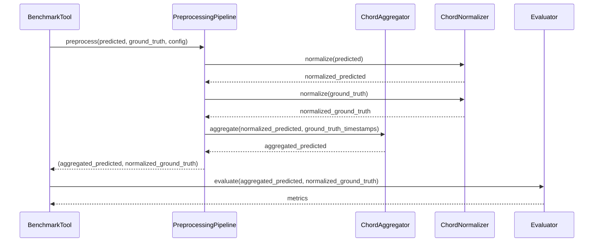

# 設計書: コード評価前処理機能（Chord Evaluation Preprocessing）

## 概要

コード認識評価システムの精度を向上させるため、予測コードと正解コードの前処理機能を実装します。現在の問題点は、予測コード数（3009個）と正解コード数（125個）の大きな差異、およびコード表記の不一致により、評価精度が低い（ルート音17.22%、品質12.50%、完全一致0.07%）ことです。この設計では、時間解像度の違いを吸収するコード集約機能と、表記の違いを統一するコード正規化機能を提供します。

## メインアルゴリズム/ワークフロー



## コアインターフェース/型定義

```python
from dataclasses import dataclass
from typing import List, Optional, Dict, Any
from enum import Enum


class NormalizationMode(Enum):
    """コード正規化モード"""
    SLASH = "slash"  # スラッシュ記法: C/E
    ON = "on"  # on記法: ConE
    STANDARD = "standard"  # 標準記法（最も一般的な形式）


class AggregationStrategy(Enum):
    """コード集約戦略"""
    MOST_FREQUENT = "most_frequent"  # 最頻出コード
    LONGEST_DURATION = "longest_duration"  # 最長持続時間コード
    FIRST = "first"  # 最初のコード
    LAST = "last"  # 最後のコード


@dataclass
class PreprocessingConfig:
    """前処理設定"""
    enable_normalization: bool = True
    enable_aggregation: bool = True
    normalization_mode: NormalizationMode = NormalizationMode.STANDARD
    aggregation_strategy: AggregationStrategy = AggregationStrategy.MOST_FREQUENT
    aggregation_tolerance: float = 0.1  # タイムスタンプの許容誤差（秒）


@dataclass
class ChordWithTimestamp:
    """タイムスタンプ付きコード"""
    chord: str
    start_time: float
    end_time: Optional[float] = None
    
    @property
    def duration(self) -> float:
        """持続時間を計算"""
        if self.end_time is None:
            return 0.0
        return self.end_time - self.start_time


class PreprocessingPipeline:
    """前処理パイプライン"""
    
    def __init__(self, config: PreprocessingConfig):
        """
        前処理パイプラインを初期化
        
        Args:
            config: 前処理設定
        """
        pass
    
    def preprocess(
        self,
        predicted: List[str],
        ground_truth: List[str],
        predicted_timestamps: Optional[List[float]] = None,
        ground_truth_timestamps: Optional[List[float]] = None
    ) -> tuple[List[str], List[str]]:
        """
        予測コードと正解コードを前処理
        
        Args:
            predicted: 予測コードリスト
            ground_truth: 正解コードリスト
            predicted_timestamps: 予測コードのタイムスタンプ（オプション）
            ground_truth_timestamps: 正解コードのタイムスタンプ（オプション）
        
        Returns:
            前処理済みの(予測コード, 正解コード)のタプル
        """
        pass


class ChordNormalizer:
    """コード表記正規化"""
    
    def __init__(self, mode: NormalizationMode = NormalizationMode.STANDARD):
        """
        コード正規化器を初期化
        
        Args:
            mode: 正規化モード
        """
        pass
    
    def normalize(self, chord: str) -> str:
        """
        コード表記を正規化
        
        Args:
            chord: 正規化するコード
        
        Returns:
            正規化されたコード
        """
        pass
    
    def normalize_batch(self, chords: List[str]) -> List[str]:
        """
        複数のコードを一括正規化
        
        Args:
            chords: 正規化するコードリスト
        
        Returns:
            正規化されたコードリスト
        """
        pass


class ChordAggregator:
    """コード集約"""
    
    def __init__(
        self,
        strategy: AggregationStrategy = AggregationStrategy.MOST_FREQUENT,
        tolerance: float = 0.1
    ):
        """
        コード集約器を初期化
        
        Args:
            strategy: 集約戦略
            tolerance: タイムスタンプの許容誤差（秒）
        """
        pass
    
    def aggregate(
        self,
        predicted_chords: List[str],
        predicted_timestamps: List[float],
        target_timestamps: List[float]
    ) -> List[str]:
        """
        予測コードを目標タイムスタンプに合わせて集約
        
        Args:
            predicted_chords: 予測コードリスト
            predicted_timestamps: 予測コードのタイムスタンプ
            target_timestamps: 目標タイムスタンプ（正解データの時間解像度）
        
        Returns:
            集約されたコードリスト
        """
        pass
```

## 主要関数の形式仕様

### 関数1: PreprocessingPipeline.preprocess()

```python
def preprocess(
    self,
    predicted: List[str],
    ground_truth: List[str],
    predicted_timestamps: Optional[List[float]] = None,
    ground_truth_timestamps: Optional[List[float]] = None
) -> tuple[List[str], List[str]]:
    """予測コードと正解コードを前処理"""
    pass
```

**事前条件:**
- `predicted` は空でないリスト
- `ground_truth` は空でないリスト
- タイムスタンプが提供される場合、コード数と一致する
- タイムスタンプは昇順にソートされている

**事後条件:**
- 返り値は2つのリストのタプル
- 正規化が有効な場合、両方のリストのコードが正規化されている
- 集約が有効な場合、予測コードが正解コードの時間解像度に集約されている
- 集約後の予測コード数は正解コード数と一致する（集約が有効な場合）

**ループ不変条件:** N/A

### 関数2: ChordNormalizer.normalize()

```python
def normalize(self, chord: str) -> str:
    """コード表記を正規化"""
    pass
```

**事前条件:**
- `chord` は空でない文字列
- `chord` は有効なコード表記

**事後条件:**
- 返り値は正規化されたコード文字列
- ルート音、品質、ベース音が標準形式に変換されている
- スラッシュコードの表記が統一されている（`/` または `on`）
- 品質表記が統一されている（例: `maj` → `M`, `min` → `m`）

**ループ不変条件:** N/A

### 関数3: ChordAggregator.aggregate()

```python
def aggregate(
    self,
    predicted_chords: List[str],
    predicted_timestamps: List[float],
    target_timestamps: List[float]
) -> List[str]:
    """予測コードを目標タイムスタンプに合わせて集約"""
    pass
```

**事前条件:**
- `predicted_chords` と `predicted_timestamps` の長さが一致
- `predicted_timestamps` と `target_timestamps` は昇順にソートされている
- すべてのタイムスタンプは非負の値

**事後条件:**
- 返り値のリスト長は `target_timestamps` の長さと一致
- 各目標タイムスタンプ区間に対して、最適なコードが選択されている
- 選択戦略（最頻出、最長持続時間など）に従ってコードが集約されている

**ループ不変条件:**
- 処理済みの各区間に対して、有効なコードが割り当てられている
- タイムスタンプの順序が保持されている

## アルゴリズム疑似コード

### メイン前処理アルゴリズム

```python
def preprocess(
    self,
    predicted: List[str],
    ground_truth: List[str],
    predicted_timestamps: Optional[List[float]] = None,
    ground_truth_timestamps: Optional[List[float]] = None
) -> tuple[List[str], List[str]]:
    """
    予測コードと正解コードを前処理
    
    INPUT: predicted (予測コードリスト), ground_truth (正解コードリスト),
           predicted_timestamps (オプション), ground_truth_timestamps (オプション)
    OUTPUT: (前処理済み予測コード, 前処理済み正解コード)
    """
    # ステップ1: 入力検証
    if not predicted or not ground_truth:
        raise ValueError("コードリストは空であってはならない")
    
    # ステップ2: コード正規化（有効な場合）
    if self.config.enable_normalization:
        normalized_predicted = self.normalizer.normalize_batch(predicted)
        normalized_ground_truth = self.normalizer.normalize_batch(ground_truth)
    else:
        normalized_predicted = predicted
        normalized_ground_truth = ground_truth
    
    # ステップ3: コード集約（有効な場合）
    if self.config.enable_aggregation:
        if predicted_timestamps is None or ground_truth_timestamps is None:
            # タイムスタンプがない場合は集約をスキップ
            aggregated_predicted = normalized_predicted
        else:
            aggregated_predicted = self.aggregator.aggregate(
                normalized_predicted,
                predicted_timestamps,
                ground_truth_timestamps
            )
    else:
        aggregated_predicted = normalized_predicted
    
    return (aggregated_predicted, normalized_ground_truth)
```

**事前条件:**
- predicted と ground_truth は空でないリスト
- タイムスタンプが提供される場合、対応するコードリストと長さが一致

**事後条件:**
- 返り値は2つのリストのタプル
- 設定に応じて正規化と集約が適用されている

**ループ不変条件:** N/A

### コード正規化アルゴリズム

```python
def normalize(self, chord: str) -> str:
    """
    コード表記を正規化
    
    INPUT: chord (コード文字列)
    OUTPUT: normalized_chord (正規化されたコード文字列)
    """
    # ステップ1: 空白を削除
    chord = chord.strip()
    
    if not chord:
        raise ValueError("コードは空であってはならない")
    
    # ステップ2: ルート音、品質、ベース音を抽出
    root, quality, bass = self._parse_chord(chord)
    
    # ステップ3: ルート音を正規化（大文字化、異名同音の統一）
    normalized_root = self._normalize_root(root)
    
    # ステップ4: 品質を正規化（標準形式に変換）
    normalized_quality = self._normalize_quality(quality)
    
    # ステップ5: ベース音を正規化（存在する場合）
    if bass:
        normalized_bass = self._normalize_root(bass)
    else:
        normalized_bass = None
    
    # ステップ6: 正規化されたコードを構築
    normalized_chord = self._build_chord(
        normalized_root,
        normalized_quality,
        normalized_bass
    )
    
    return normalized_chord
```

**事前条件:**
- chord は空でない文字列

**事後条件:**
- 返り値は正規化されたコード文字列
- ルート音、品質、ベース音が標準形式

**ループ不変条件:** N/A

### コード集約アルゴリズム

```python
def aggregate(
    self,
    predicted_chords: List[str],
    predicted_timestamps: List[float],
    target_timestamps: List[float]
) -> List[str]:
    """
    予測コードを目標タイムスタンプに合わせて集約
    
    INPUT: predicted_chords (予測コードリスト),
           predicted_timestamps (予測タイムスタンプ),
           target_timestamps (目標タイムスタンプ)
    OUTPUT: aggregated_chords (集約されたコードリスト)
    """
    # ステップ1: 入力検証
    if len(predicted_chords) != len(predicted_timestamps):
        raise ValueError("コード数とタイムスタンプ数が一致しない")
    
    aggregated_chords = []
    
    # ステップ2: 各目標タイムスタンプ区間を処理
    for i in range(len(target_timestamps)):
        # 区間の開始時刻と終了時刻を決定
        start_time = target_timestamps[i]
        end_time = target_timestamps[i + 1] if i + 1 < len(target_timestamps) else float('inf')
        
        # この区間内の予測コードを収集
        chords_in_interval = []
        for j in range(len(predicted_chords)):
            pred_time = predicted_timestamps[j]
            
            # 許容誤差を考慮して区間内かチェック
            if start_time - self.tolerance <= pred_time < end_time + self.tolerance:
                chords_in_interval.append((predicted_chords[j], pred_time))
        
        # ステップ3: 集約戦略に基づいてコードを選択
        if not chords_in_interval:
            # 区間内にコードがない場合、最も近いコードを選択
            selected_chord = self._find_nearest_chord(
                predicted_chords,
                predicted_timestamps,
                start_time
            )
        else:
            selected_chord = self._select_chord_by_strategy(chords_in_interval)
        
        aggregated_chords.append(selected_chord)
    
    return aggregated_chords
```

**事前条件:**
- predicted_chords と predicted_timestamps の長さが一致
- タイムスタンプは昇順にソート済み
- すべてのタイムスタンプは非負

**事後条件:**
- 返り値のリスト長は target_timestamps の長さと一致
- 各区間に対して有効なコードが選択されている

**ループ不変条件:**
- 処理済みの各区間に対して、有効なコードが割り当てられている
- aggregated_chords の長さは処理済み区間数と一致

## 使用例

```python
from src.evaluation.preprocessing import (
    PreprocessingPipeline,
    PreprocessingConfig,
    NormalizationMode,
    AggregationStrategy
)

# 例1: 基本的な使用法
config = PreprocessingConfig(
    enable_normalization=True,
    enable_aggregation=True,
    normalization_mode=NormalizationMode.STANDARD,
    aggregation_strategy=AggregationStrategy.MOST_FREQUENT
)

pipeline = PreprocessingPipeline(config)

# 予測コード（3009個）と正解コード（125個）
predicted = ["Cmaj/B", "Cmaj/B", "C/B", "Dsus2/C", ...]  # 3009個
ground_truth = ["C/B", "Dsus2/C", "AonC#", ...]  # 125個

# タイムスタンプ
predicted_timestamps = [0.0, 0.1, 0.2, ...]  # 3009個
ground_truth_timestamps = [0.0, 2.5, 5.0, ...]  # 125個

# 前処理を実行
processed_predicted, processed_ground_truth = pipeline.preprocess(
    predicted,
    ground_truth,
    predicted_timestamps,
    ground_truth_timestamps
)

# 結果: processed_predicted は125個に集約され、表記が統一される
print(f"集約前: {len(predicted)}個")  # 3009個
print(f"集約後: {len(processed_predicted)}個")  # 125個
print(f"正解データ: {len(processed_ground_truth)}個")  # 125個

# 例2: 正規化のみ使用
config_normalize_only = PreprocessingConfig(
    enable_normalization=True,
    enable_aggregation=False
)

pipeline_normalize = PreprocessingPipeline(config_normalize_only)
normalized_pred, normalized_gt = pipeline_normalize.preprocess(
    predicted,
    ground_truth
)

# 例3: 集約戦略の変更
config_longest = PreprocessingConfig(
    enable_normalization=True,
    enable_aggregation=True,
    aggregation_strategy=AggregationStrategy.LONGEST_DURATION
)

pipeline_longest = PreprocessingPipeline(config_longest)
aggregated_pred, aggregated_gt = pipeline_longest.preprocess(
    predicted,
    ground_truth,
    predicted_timestamps,
    ground_truth_timestamps
)

# 例4: BenchmarkToolとの統合
from src.evaluation import BenchmarkTool

tool = BenchmarkTool()

# 前処理パイプラインを設定
tool.set_preprocessing_pipeline(pipeline)

# ベンチマークを実行（自動的に前処理が適用される）
results = tool.run_benchmark(audio_dir, ground_truth_dir)
```

## 正確性プロパティ

*プロパティとは、システムの全ての有効な実行において真であるべき特性や振る舞いのことです。本質的には、システムが何をすべきかについての形式的な記述です。プロパティは、人間が読める仕様と機械で検証可能な正確性保証の橋渡しとなります。*

### プロパティ1: 正規化の冪等性

*任意の*有効なコード文字列に対して、正規化を2回適用した結果は、1回適用した結果と同じである

**検証要件: 要件1.6**

### プロパティ2: バッチ正規化の等価性

*任意の*コードリストに対して、バッチ正規化の結果は、各コードを個別に正規化した結果のリストと同じである

**検証要件: 要件1.7**

### プロパティ3: 空白除去

*任意の*空白を含むコード文字列に対して、正規化後のコードには空白が含まれない

**検証要件: 要件1.1**

### プロパティ4: ルート音の保持

*任意の*有効なコードに対して、正規化後もルート音の音高（ピッチクラス）が保持される

**検証要件: 要件8.1**

### プロパティ5: 品質の保持

*任意の*有効なコードに対して、正規化後もコードの品質（メジャー、マイナー、sus2など）が保持される

**検証要件: 要件8.2**

### プロパティ6: ベース音の保持

*任意の*ベース音を含むコード（スラッシュコード）に対して、正規化後もベース音の音高が保持される

**検証要件: 要件8.3**

### プロパティ7: 集約後のコード数一致

*任意の*予測コードリスト、予測タイムスタンプ、目標タイムスタンプに対して、集約後のコード数は目標タイムスタンプ数と一致する

**検証要件: 要件2.1, 要件2.8**

### プロパティ8: 最頻出戦略の正確性

*任意の*タイムスタンプ区間に対して、MOST_FREQUENT戦略で集約されたコードは、その区間内で最も頻繁に出現するコードである

**検証要件: 要件2.2**

### プロパティ9: 最長持続時間戦略の正確性

*任意の*タイムスタンプ区間に対して、LONGEST_DURATION戦略で集約されたコードは、その区間内で最も長い持続時間を持つコードである

**検証要件: 要件2.3**

### プロパティ10: 最初戦略の正確性

*任意の*タイムスタンプ区間に対して、FIRST戦略で集約されたコードは、その区間内の最初のコードである

**検証要件: 要件2.4**

### プロパティ11: 最後戦略の正確性

*任意の*タイムスタンプ区間に対して、LAST戦略で集約されたコードは、その区間内の最後のコードである

**検証要件: 要件2.5**

### プロパティ12: タイムスタンプ順序の保持

*任意の*予測コードとタイムスタンプに対して、集約後もタイムスタンプの順序が保持される（i番目の区間のコードはi+1番目の区間のコードより前の時刻に対応する）

**検証要件: 要件8.4**

### プロパティ13: 許容誤差の適用

*任意の*タイムスタンプ区間と許容誤差に対して、区間境界から許容誤差内のコードは区間内として扱われる

**検証要件: 要件2.7**

### プロパティ14: 正規化有効時の適用

*任意の*コードリストに対して、正規化が有効に設定されている場合、前処理パイプラインは予測コードと正解コードの両方を正規化する

**検証要件: 要件3.2**

### プロパティ15: 集約有効時の適用

*任意の*コードリストとタイムスタンプに対して、集約が有効に設定されている場合、前処理パイプラインは予測コードを正解コードの時間解像度に集約する

**検証要件: 要件3.3**

### プロパティ16: 処理順序の保証

*任意の*コードリストとタイムスタンプに対して、正規化と集約の両方が有効な場合、正規化が先に実行され、その後集約が実行される

**検証要件: 要件3.4**

### プロパティ17: 無効時の恒等性

*任意の*コードリストに対して、正規化と集約の両方が無効な場合、前処理パイプラインは入力をそのまま返す

**検証要件: 要件3.5**

### プロパティ18: タイムスタンプ欠如時の集約スキップ

*任意の*コードリストに対して、タイムスタンプが提供されない場合、前処理パイプラインは集約をスキップする

**検証要件: 要件3.6**

### プロパティ19: 返り値の型保証

*任意の*入力に対して、前処理パイプラインは2つのリストのタプル（予測コード、正解コード）を返す

**検証要件: 要件3.7**

### プロパティ20: 無効コードのエラー検出

*任意の*無効なコード表記に対して、正規化器はValueErrorを発生させる

**検証要件: 要件1.8, 要件6.1**

### プロパティ21: 長さ不一致のエラー検出

*任意の*コードリストとタイムスタンプに対して、長さが一致しない場合、集約器はValueErrorを発生させる

**検証要件: 要件2.9, 要件6.2**

### プロパティ22: 未ソートタイムスタンプのエラー検出

*任意の*昇順にソートされていないタイムスタンプに対して、集約器はValueErrorを発生させる

**検証要件: 要件2.10, 要件6.4**

### プロパティ23: 負のタイムスタンプのエラー検出

*任意の*負のタイムスタンプを含む入力に対して、システムはValueErrorを発生させる

**検証要件: 要件6.5**

## エラーハンドリング

### エラーシナリオ1: 無効なコード表記

**条件**: 正規化できない無効なコード表記が入力される
**応答**: `ValueError` を発生させ、詳細なエラーメッセージを提供
**回復**: ログに警告を記録し、元のコードをそのまま返す（オプション）

### エラーシナリオ2: タイムスタンプの不一致

**条件**: コード数とタイムスタンプ数が一致しない
**応答**: `ValueError` を発生させる
**回復**: タイムスタンプなしで処理を続行（集約をスキップ）

### エラーシナリオ3: 空のコードリスト

**条件**: 空のコードリストが入力される
**応答**: `ValueError` を発生させる
**回復**: 空のリストを返す

### エラーシナリオ4: タイムスタンプの順序不正

**条件**: タイムスタンプが昇順にソートされていない
**応答**: `ValueError` を発生させる
**回復**: 自動的にソートしてから処理（オプション）

## テスト戦略

### ユニットテストアプローチ

各コンポーネント（`ChordNormalizer`, `ChordAggregator`, `PreprocessingPipeline`）に対して独立したユニットテストを作成します。

**主要なテストケース:**
- コード正規化の各パターン（スラッシュコード、品質表記、異名同音）
- 集約戦略の各パターン（最頻出、最長持続時間、最初、最後）
- エッジケース（空リスト、単一要素、タイムスタンプなし）
- エラーケース（無効な入力、不一致、順序不正）

**カバレッジ目標:** 90%以上

### プロパティベーステストアプローチ

**プロパティテストライブラリ**: hypothesis

**主要なプロパティ:**
1. 正規化の冪等性: `normalize(normalize(x)) == normalize(x)`
2. 集約後のコード数: `len(aggregate(pred, pred_t, target_t)) == len(target_t)`
3. タイムスタンプの順序保持: 集約後もタイムスタンプの順序が保持される
4. ルート音と品質の保持: 正規化後もルート音と品質が保持される
5. 設定の尊重: 設定に応じて正規化と集約が適用される

### 統合テストアプローチ

`BenchmarkTool` との統合テストを実施し、実際の楽曲データで前処理が正しく動作することを確認します。

**統合テストシナリオ:**
1. 実際の楽曲データ（3009個の予測コード、125個の正解コード）で前処理を実行
2. 前処理後の評価精度が向上することを確認
3. 前処理の有効/無効を切り替えて結果を比較
4. 異なる集約戦略で結果を比較

## パフォーマンス考慮事項

**時間計算量:**
- コード正規化: O(n) - n はコード数
- コード集約: O(n * m) - n は予測コード数、m は目標タイムスタンプ数
- 全体: O(n * m)

**空間計算量:**
- O(n) - 入力コードリストのサイズに比例

**最適化戦略:**
1. タイムスタンプのバイナリサーチを使用して集約を高速化（O(n log m)）
2. 正規化結果をキャッシュして重複処理を削減
3. バッチ処理で複数のコードを並列に正規化

**パフォーマンス目標:**
- 3009個のコードを125個に集約: < 100ms
- 10,000個のコードを正規化: < 500ms

## セキュリティ考慮事項

**入力検証:**
- コード文字列の長さ制限（最大100文字）
- 正規表現パターンマッチングでインジェクション攻撃を防止
- タイムスタンプの範囲検証（0 ≤ t ≤ 10,000秒）

**リソース制限:**
- 処理するコード数の上限（最大100,000個）
- メモリ使用量の監視とアラート

## 依存関係

**標準ライブラリ:**
- `dataclasses`: データクラス定義
- `enum`: 列挙型定義
- `typing`: 型ヒント
- `re`: 正規表現

**プロジェクト内部:**
- `src.evaluation.models`: データモデル
- `src.evaluation.chord_utils`: コードユーティリティ関数
- `src.evaluation.evaluator`: 評価器

**外部ライブラリ:**
- `numpy`: 数値計算（タイムスタンプ処理）
- `hypothesis`: プロパティベーステスト（テストのみ）
