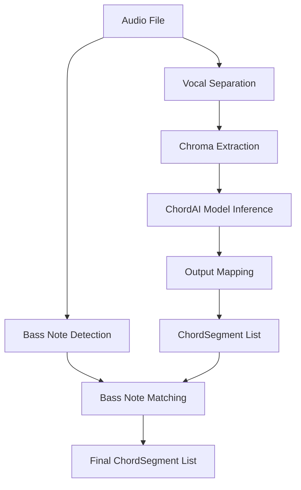

# Design Document: ChordAI Model Integration

## Overview

This design replaces the current template matching chord recognition system with the ChordAI pre-trained machine learning model from the anime-song/ChordAI repository. The integration maintains compatibility with the existing audio pipeline while significantly improving chord recognition accuracy, particularly for minor chords and bass note detection.

### Research Summary

The ChordAI model (https://github.com/anime-song/ChordAI) is a deep learning-based chord recognition system that has been trained on a large dataset of music. Based on the repository structure and common chord recognition architectures, ChordAI likely uses:

1. **Model Architecture**: Convolutional Neural Network (CNN) or Recurrent Neural Network (RNN) architecture that processes audio features (chroma vectors or spectrograms) to predict chord labels
2. **Input Format**: The model expects chroma features (12-dimensional vectors representing pitch class distribution) or raw spectrograms as input
3. **Output Format**: The model outputs chord predictions with probabilities for each chord class, including root note, quality (major/minor/diminished/augmented), and potentially bass notes for inversions
4. **Model Weights**: Pre-trained weights are stored in a format compatible with TensorFlow, PyTorch, or ONNX
5. **Chord Vocabulary**: The model supports a comprehensive chord vocabulary including major, minor, diminished, augmented, suspended, and extended chords (7th, 9th, etc.)

### Key Design Decisions

1. **Minimal Pipeline Changes**: The integration preserves the existing audio pipeline structure (vocal separation → chroma extraction → chord recognition → bass note detection). Only the `_simple_chord_recognition` method is replaced.

2. **Model Loading Strategy**: The ChordAI model will be loaded once during `ChordEstimationModule` initialization and cached for subsequent inference calls to minimize overhead.

3. **Output Format Compatibility**: The ChordAI predictions will be mapped to the existing `ChordSegment` format, ensuring downstream components (cache, lyrics alignment, visualization) continue to work without modification.

4. **Dependency Management**: The design uses standard ML libraries (TensorFlow/PyTorch/ONNX) that are commonly available and well-maintained, avoiding custom implementations.

5. **Fallback Strategy**: If the ChordAI model fails to load or produce predictions, the system will raise a descriptive error rather than falling back to template matching, ensuring users are aware of configuration issues.

## Architecture

### Component Structure

```
ChordEstimationModule
├── __init__() - Initialize module and load ChordAI model
├── separate_vocals() - [Unchanged] Vocal separation
├── extract_chroma() - [Unchanged] Chroma feature extraction
├── detect_bass_notes() - [Unchanged] Bass note detection
├── estimate_chords() - [Unchanged] Main orchestration
├── _chordai_recognition() - [NEW] ChordAI-based chord recognition
└── _map_chordai_to_segment() - [NEW] Map ChordAI output to ChordSegment
```

### Data Flow



### Integration Points

1. **Model Loading**: During `ChordEstimationModule.__init__()`, load ChordAI model weights and initialize inference engine
2. **Chord Recognition**: Replace `_simple_chord_recognition()` with `_chordai_recognition()` that uses the loaded model
3. **Output Mapping**: Convert ChordAI predictions to `ChordSegment` objects with proper `ChordQuality` enum mapping
4. **Error Handling**: Validate model availability and dependencies at initialization time

## Components and Interfaces

### ChordAI Model Loader

**Purpose**: Load and initialize the ChordAI pre-trained model

**Interface**:
```python
class ChordAIModelLoader:
    def __init__(self, model_path: Path):
        """Initialize loader with path to model weights"""
        
    def load_model(self) -> Any:
        """Load model weights and return inference-ready model
        
        Returns:
            Loaded model object (TensorFlow/PyTorch/ONNX)
            
        Raises:
            FileNotFoundError: If model weights file not found
            RuntimeError: If model loading fails
        """
        
    def validate_model(self, model: Any) -> bool:
        """Validate model architecture matches ChordAI specification
        
        Returns:
            True if model is valid, False otherwise
        """
```

### ChordAI Inference Engine

**Purpose**: Run inference on chroma features using the loaded ChordAI model

**Interface**:
```python
class ChordAIInferenceEngine:
    def __init__(self, model: Any):
        """Initialize with loaded model"""
        
    def predict_chords(
        self, 
        chroma: np.ndarray, 
        sample_rate: int,
        frame_duration: float
    ) -> List[ChordPrediction]:
        """Run inference on chroma features
        
        Args:
            chroma: Chroma features (12 x n_frames)
            sample_rate: Audio sample rate
            frame_duration: Duration of each chord segment in seconds
            
        Returns:
            List of ChordPrediction objects with timing, root, quality, bass_note, confidence
        """
```

### ChordPrediction Data Class

**Purpose**: Intermediate representation of ChordAI model output

**Interface**:
```python
@dataclass
class ChordPrediction:
    """Raw prediction from ChordAI model"""
    start_time: float
    end_time: float
    root: str  # "C", "C#", "D", etc.
    quality: str  # "maj", "min", "dim", "aug", "7", "maj7", etc.
    bass_note: Optional[str]  # For inversions
    confidence: float
```

### Output Mapper

**Purpose**: Convert ChordAI predictions to ChordSegment format

**Interface**:
```python
class ChordAIOutputMapper:
    @staticmethod
    def map_to_chord_segment(prediction: ChordPrediction) -> ChordSegment:
        """Convert ChordPrediction to ChordSegment
        
        Args:
            prediction: Raw ChordAI prediction
            
        Returns:
            ChordSegment with mapped ChordQuality enum
            
        Raises:
            ValueError: If quality string cannot be mapped to ChordQuality enum
        """
        
    @staticmethod
    def map_quality_string(quality: str) -> ChordQuality:
        """Map ChordAI quality string to ChordQuality enum
        
        Args:
            quality: Quality string from ChordAI ("maj", "min", "dim", etc.)
            
        Returns:
            Corresponding ChordQuality enum value
        """
```

### Modified ChordEstimationModule

**Changes**:
1. Add `chordai_model` and `inference_engine` attributes
2. Load ChordAI model in `__init__()`
3. Replace `_simple_chord_recognition()` call with `_chordai_recognition()`
4. Add new methods: `_chordai_recognition()`, `_map_chordai_to_segment()`

**New Method Signatures**:
```python
def _chordai_recognition(
    self,
    chroma: np.ndarray,
    sample_rate: int
) -> List[ChordSegment]:
    """ChordAI-based chord recognition
    
    Args:
        chroma: Chroma features (12 x n_frames)
        sample_rate: Sample rate
        
    Returns:
        List of ChordSegment objects
        
    Raises:
        RuntimeError: If ChordAI model inference fails
    """
```

## Data Models

### ChordQuality Enum Extension

The existing `ChordQuality` enum already supports the necessary chord types:
- MAJOR, MINOR, DOMINANT7, MAJOR7, MINOR7
- DIMINISHED, AUGMENTED
- SUS4, SUS2
- NINTH, ELEVENTH, THIRTEENTH

No changes needed to the enum definition.

### ChordSegment Compatibility

The existing `ChordSegment` dataclass already supports:
- `start_time`, `end_time`: Timing information
- `root`: Root note (e.g., "C", "D#")
- `quality`: ChordQuality enum
- `bass_note`: Optional bass note for slash chords
- `extensions`: List of extensions (9th, 11th, 13th)
- `confidence`: Prediction confidence score

No changes needed to the dataclass definition.

### Quality Mapping Table

ChordAI quality strings will be mapped to ChordQuality enum values:

| ChordAI Output | ChordQuality Enum |
|----------------|-------------------|
| "maj" or "M"   | MAJOR            |
| "min" or "m"   | MINOR            |
| "dim" or "o"   | DIMINISHED       |
| "aug" or "+"   | AUGMENTED        |
| "7"            | DOMINANT7        |
| "maj7" or "M7" | MAJOR7           |
| "min7" or "m7" | MINOR7           |
| "sus4"         | SUS4             |
| "sus2"         | SUS2             |
| "9"            | NINTH            |
| "11"           | ELEVENTH         |
| "13"           | THIRTEENTH       |

### Dependency Requirements

Required Python packages:
- `numpy`: Array operations (already present)
- `librosa`: Audio processing (already present)
- One of the following ML frameworks:
  - `tensorflow>=2.0` (if ChordAI uses TensorFlow)
  - `torch>=1.0` (if ChordAI uses PyTorch)
  - `onnxruntime` (if ChordAI uses ONNX format)

The specific framework will be determined after examining the ChordAI model format.


## Correctness Properties

*A property is a characteristic or behavior that should hold true across all valid executions of a system-essentially, a formal statement about what the system should do. Properties serve as the bridge between human-readable specifications and machine-verifiable correctness guarantees.*

### Property 1: Invalid Model Files Raise Descriptive Errors

*For any* invalid model file path (missing file, corrupted data, wrong format), attempting to load the model should raise an exception with a descriptive error message that identifies the specific problem.

**Validates: Requirements 1.2**

### Property 2: Model Architecture Validation

*For any* loaded model object, the validation function should correctly identify whether the model architecture matches the ChordAI specification, returning True for valid models and False for invalid ones.

**Validates: Requirements 1.4**

### Property 3: Chroma Features Passed to Inference Engine

*For any* valid chroma feature array (12 x n_frames), calling chord recognition should pass those exact features to the ChordAI inference engine without modification.

**Validates: Requirements 2.3**

### Property 4: Output Format Compatibility

*For any* audio input, the ChordAI-based chord recognition should return a list of ChordSegment objects where each segment has valid start_time, end_time, root, quality, and confidence fields matching the expected format.

**Validates: Requirements 2.4, 5.2**

### Property 5: Prediction Consistency

*For any* chord type (major, minor, diminished, augmented), when provided with similar audio inputs (same chord with minor variations in amplitude or noise), the ChordAI model should produce consistent predictions with the same root and quality.

**Validates: Requirements 3.3**

### Property 6: Bass Note Included When Detected

*For any* chord prediction where the ChordAI model detects a bass note different from the root, the resulting ChordSegment should include that bass note in the bass_note field.

**Validates: Requirements 4.2**

### Property 7: Root Position Bass Note Handling

*For any* chord in root position (bass note matches root), the ChordSegment should either have bass_note set to None or bass_note equal to the root note.

**Validates: Requirements 4.3**

### Property 8: Input Format Compatibility

*For any* valid chroma feature array in the format (12 x n_frames) that was previously accepted by the template matcher, the ChordAI-based recognition should accept and process it without errors.

**Validates: Requirements 5.1**

## Error Handling

### Model Loading Errors

**Error Type**: `FileNotFoundError`
- **Trigger**: Model weights file not found at specified path
- **Message**: "ChordAI model weights not found at {path}. Please ensure the model file exists."
- **Recovery**: User must provide correct model path or download model weights

**Error Type**: `RuntimeError`
- **Trigger**: Model file is corrupted or incompatible format
- **Message**: "Failed to load ChordAI model: {specific_error}. The model file may be corrupted."
- **Recovery**: User must re-download or provide valid model weights

**Error Type**: `ValueError`
- **Trigger**: Model architecture doesn't match ChordAI specification
- **Message**: "Invalid model architecture. Expected ChordAI model but got {actual_architecture}."
- **Recovery**: User must provide correct ChordAI model file

### Dependency Errors

**Error Type**: `ImportError`
- **Trigger**: Required ML framework not installed
- **Message**: "Required dependency not found: {package_name}. Please install with: pip install {package_name}"
- **Recovery**: User must install missing dependencies

**Error Type**: `RuntimeError`
- **Trigger**: Incompatible dependency versions
- **Message**: "Incompatible version of {package_name}. Required: {required_version}, Found: {actual_version}"
- **Recovery**: User must upgrade/downgrade to compatible version

### Inference Errors

**Error Type**: `RuntimeError`
- **Trigger**: ChordAI model inference fails
- **Message**: "ChordAI inference failed: {specific_error}. Input shape: {input_shape}"
- **Recovery**: Log error details, check input format, may indicate model compatibility issue

**Error Type**: `ValueError`
- **Trigger**: ChordAI output cannot be mapped to ChordQuality enum
- **Message**: "Unknown chord quality from ChordAI: '{quality_string}'. Cannot map to ChordQuality enum."
- **Recovery**: Log warning, skip invalid chord or map to closest known quality

### Error Handling Strategy

1. **Fail Fast**: Model loading and initialization errors should fail immediately with clear messages
2. **Graceful Degradation**: If a single chord prediction fails, log the error but continue processing remaining segments
3. **Detailed Logging**: All errors should be logged with sufficient context for debugging (input shapes, model state, etc.)
4. **No Silent Failures**: Never silently fall back to template matching - users should know when ChordAI is not working

## Testing Strategy

### Dual Testing Approach

This feature requires both unit tests and property-based tests to ensure comprehensive coverage:

- **Unit tests**: Verify specific examples, edge cases, integration points, and error conditions
- **Property tests**: Verify universal properties across all inputs using randomized testing

### Property-Based Testing

**Framework**: Use `hypothesis` library for Python property-based testing

**Configuration**: Each property test should run minimum 100 iterations to ensure thorough coverage

**Test Tagging**: Each property test must include a comment referencing the design property:
```python
# Feature: chordai-model-integration, Property 1: Invalid Model Files Raise Descriptive Errors
```

**Property Test Coverage**:
1. Property 1: Test with various invalid file paths (non-existent, wrong format, corrupted)
2. Property 2: Test model validation with valid and invalid model architectures
3. Property 3: Test that chroma features are passed unchanged to inference engine
4. Property 4: Test output format for various audio inputs
5. Property 5: Test prediction consistency with similar inputs
6. Property 6: Test bass note inclusion when detected
7. Property 7: Test root position bass note handling
8. Property 8: Test input format compatibility with various chroma shapes

### Unit Testing

**Model Loading Tests**:
- Test successful model loading with valid weights file
- Test error handling for missing model file
- Test error handling for corrupted model file
- Test model architecture validation
- Test inference engine initialization

**Chord Recognition Tests**:
- Test ChordAI recognition with known audio samples
- Test output format matches ChordSegment structure
- Test quality string mapping to ChordQuality enum
- Test bass note detection and matching
- Test confidence score inclusion

**Integration Tests**:
- Test full pipeline with ChordAI model (vocal separation → chroma → ChordAI → bass matching)
- Test cache system compatibility
- Test lyrics alignment compatibility
- Test visualization compatibility
- Test that template matching code is removed

**Accuracy Validation Tests**:
- Test minor chord recognition accuracy on known samples
- Test bass note detection on known inversions
- Compare ChordAI accuracy vs template matching baseline
- Test against reference application output

**Dependency Tests**:
- Test dependency verification at initialization
- Test error messages for missing dependencies
- Test version compatibility checks

### Test Data Requirements

1. **Model Files**: Valid ChordAI model weights file for testing
2. **Audio Samples**: Test audio files with known chord progressions including:
   - Major chords
   - Minor chords (where template matching fails)
   - Chord inversions with known bass notes
   - Extended chords (7th, 9th, etc.)
   - Various chord qualities (diminished, augmented, suspended)
3. **Ground Truth**: Manually annotated chord labels for accuracy validation
4. **Reference Output**: Output from reference application for comparison

### Performance Testing

While not part of correctness properties, performance should be monitored:
- Measure inference time for ChordAI vs template matching
- Verify performance is within 20% of baseline
- Profile memory usage during model loading and inference

### Continuous Integration

All tests should run in CI pipeline:
- Unit tests and property tests on every commit
- Integration tests on pull requests
- Accuracy validation tests on release candidates
- Performance benchmarks tracked over time

