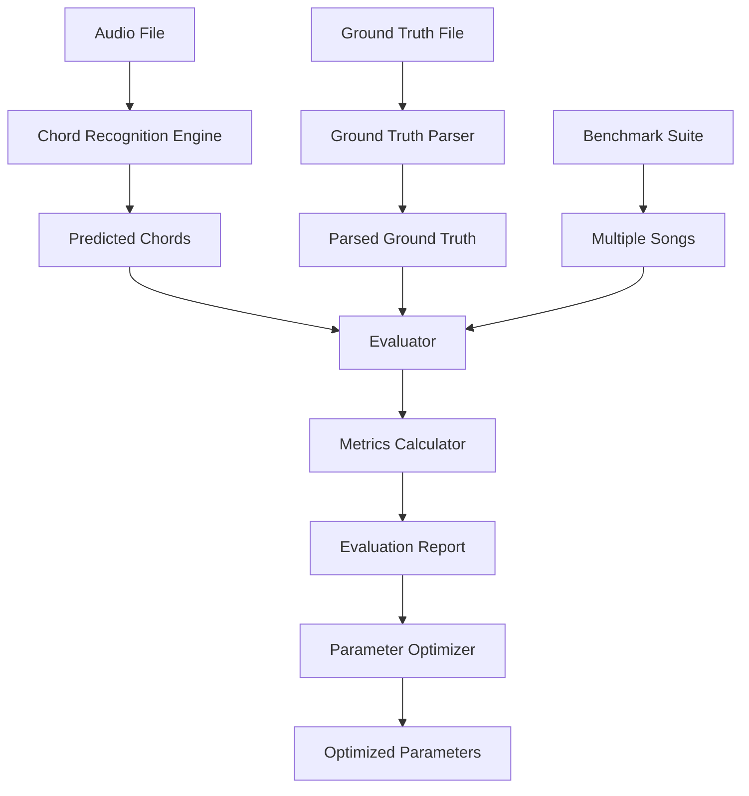
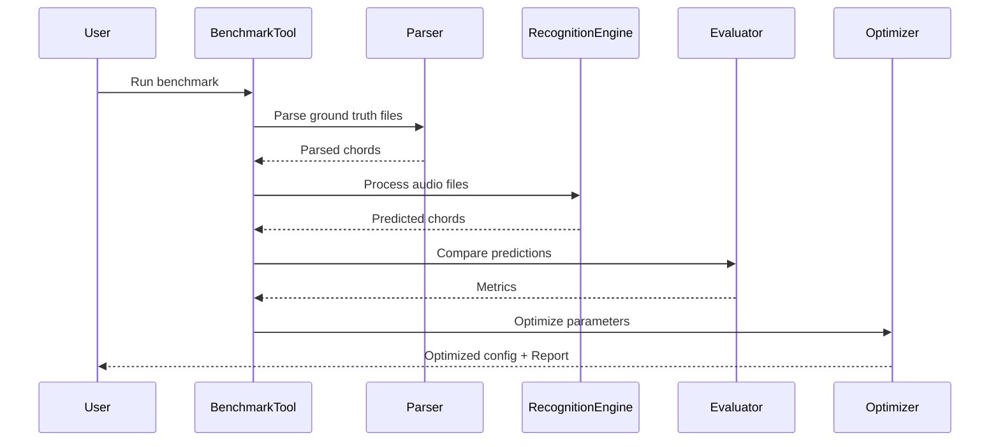

# Design Document: Evaluation System

## Overview

評価システムは、コード認識エンジンの精度を測定し、パラメータを最適化するための包括的なベンチマークフレームワークです。正解データパーサー、複数の評価指標、ベンチマークツール、パラメータ最適化機能を提供し、ChordAI統合後のシステム品質を定量的に評価します。

## Architecture



## Main Algorithm/Workflow



## Components and Interfaces

### Component 1: Ground Truth Parser

**Purpose**: 3種類のフォーマットから正解データを抽出

**Interface**:
```python
from typing import List, Tuple
from dataclasses import dataclass

@dataclass
class ChordAnnotation:
    chord: str
    position: int  # Character position or bar number
    
class GroundTruthParser:
    def parse(self, content: str, format_type: str) -> List[ChordAnnotation]:
        """Parse ground truth from various formats"""
        pass
    
    def detect_format(self, content: str) -> str:
        """Auto-detect format type"""
        pass
```

**Responsibilities**:
- コード進行のみフォーマットのパース: `[D][AonC#][Bm7]`
- 歌詞+コードフォーマットのパース: `涙[D]があふれ[AonC#]る`
- 歌詞のみフォーマットの処理（コード情報なし）
- フォーマット自動検出

### Component 2: Evaluator

**Purpose**: 予測結果と正解データを比較し、複数の評価指標を計算

**Interface**:
```python
from typing import Dict, Any

@dataclass
class EvaluationMetrics:
    sequence_accuracy: float
    root_accuracy: float
    quality_accuracy: float
    dtw_distance: float
    exact_match_rate: float
    
class Evaluator:
    def evaluate(
        self,
        predicted: List[str],
        ground_truth: List[str]
    ) -> EvaluationMetrics:
        """Evaluate predicted chords against ground truth"""
        pass
    
    def sequence_match(
        self,
        predicted: List[str],
        ground_truth: List[str]
    ) -> float:
        """Calculate sequence matching accuracy"""
        pass
    
    def root_accuracy(
        self,
        predicted: List[str],
        ground_truth: List[str]
    ) -> float:
        """Calculate root note accuracy"""
        pass
    
    def quality_accuracy(
        self,
        predicted: List[str],
        ground_truth: List[str]
    ) -> float:
        """Calculate chord quality accuracy"""
        pass
    
    def dtw_distance(
        self,
        predicted: List[str],
        ground_truth: List[str]
    ) -> float:
        """Calculate DTW distance for temporal alignment"""
        pass
```

**Responsibilities**:
- シーケンスマッチング（コード順序の完全一致率）
- ルート音の正解率計算
- コード品質（maj, min, 7thなど）の正解率計算
- DTWによる時間的ずれを考慮した評価
- 完全一致率の計算

### Component 3: Benchmark Tool

**Purpose**: 複数楽曲での一括評価とレポート生成

**Interface**:
```python
from pathlib import Path

@dataclass
class BenchmarkResult:
    song_name: str
    metrics: EvaluationMetrics
    predicted_chords: List[str]
    ground_truth_chords: List[str]
    
class BenchmarkTool:
    def run_benchmark(
        self,
        audio_dir: Path,
        ground_truth_dir: Path
    ) -> List[BenchmarkResult]:
        """Run benchmark on multiple songs"""
        pass
    
    def generate_report(
        self,
        results: List[BenchmarkResult],
        output_path: Path
    ) -> None:
        """Generate evaluation report"""
        pass
    
    def aggregate_metrics(
        self,
        results: List[BenchmarkResult]
    ) -> Dict[str, float]:
        """Calculate aggregate statistics"""
        pass
```

**Responsibilities**:
- 複数楽曲の一括処理
- 評価レポートの生成（JSON, Markdown）
- 統計情報の集計（平均、標準偏差、最小/最大）
- 楽曲ごとの詳細結果の保存

### Component 4: Parameter Optimizer

**Purpose**: 評価結果に基づいてパラメータを自動調整

**Interface**:
```python
@dataclass
class OptimizationConfig:
    penalty_range: Tuple[float, float]
    grouping_threshold_range: Tuple[float, float]
    optimization_metric: str  # 'root_accuracy', 'quality_accuracy', etc.
    
@dataclass
class OptimizedParameters:
    maj7_penalty: float
    grouping_threshold: float
    achieved_metric: float
    
class ParameterOptimizer:
    def optimize(
        self,
        audio_dir: Path,
        ground_truth_dir: Path,
        config: OptimizationConfig
    ) -> OptimizedParameters:
        """Optimize parameters using grid search"""
        pass
    
    def grid_search(
        self,
        param_grid: Dict[str, List[float]],
        evaluation_fn: callable
    ) -> Dict[str, float]:
        """Perform grid search optimization"""
        pass
```

**Responsibilities**:
- ペナルティ値の最適化（maj7など）
- グループ化閾値の最適化
- グリッドサーチによるパラメータ探索
- 最適パラメータの保存

## Data Models

### Model 1: ChordAnnotation

```python
@dataclass
class ChordAnnotation:
    chord: str  # e.g., "D", "AonC#", "Bm7"
    position: int  # Character position or bar number
    timestamp: float = 0.0  # Optional: time in seconds
```

**Validation Rules**:
- `chord` must be non-empty string
- `position` must be non-negative integer
- `timestamp` must be non-negative float

### Model 2: EvaluationMetrics

```python
@dataclass
class EvaluationMetrics:
    sequence_accuracy: float  # 0.0 to 1.0
    root_accuracy: float  # 0.0 to 1.0
    quality_accuracy: float  # 0.0 to 1.0
    dtw_distance: float  # Non-negative
    exact_match_rate: float  # 0.0 to 1.0
```

**Validation Rules**:
- All accuracy metrics must be in range [0.0, 1.0]
- `dtw_distance` must be non-negative
- All fields must be present

### Model 3: BenchmarkResult

```python
@dataclass
class BenchmarkResult:
    song_name: str
    metrics: EvaluationMetrics
    predicted_chords: List[str]
    ground_truth_chords: List[str]
    processing_time: float = 0.0
```

**Validation Rules**:
- `song_name` must be non-empty
- `predicted_chords` and `ground_truth_chords` must be non-empty lists
- `processing_time` must be non-negative

## Key Functions with Formal Specifications

### Function 1: parse_chord_only_format()

```python
def parse_chord_only_format(content: str) -> List[ChordAnnotation]:
    """Parse chord-only format: [D][AonC#][Bm7]"""
    pass
```

**Preconditions:**
- `content` is non-null string
- `content` contains chord annotations in brackets

**Postconditions:**
- Returns list of ChordAnnotation objects
- Each annotation has valid chord name and position
- Position values are monotonically increasing
- Empty brackets are ignored

**Loop Invariants:**
- All processed chords have valid positions
- Position counter increases with each chord

### Function 2: parse_lyrics_with_chords()

```python
def parse_lyrics_with_chords(content: str) -> List[ChordAnnotation]:
    """Parse lyrics with embedded chords: 涙[D]があふれ[AonC#]る"""
    pass
```

**Preconditions:**
- `content` is non-null string
- Chords are embedded in brackets within lyrics

**Postconditions:**
- Returns list of ChordAnnotation objects
- Position reflects character position in lyrics
- Lyrics text is preserved (not returned but position is accurate)
- Empty brackets are ignored

**Loop Invariants:**
- Character position increases monotonically
- All extracted chords have valid positions

### Function 3: calculate_root_accuracy()

```python
def calculate_root_accuracy(
    predicted: List[str],
    ground_truth: List[str]
) -> float:
    """Calculate root note accuracy between predicted and ground truth"""
    pass
```

**Preconditions:**
- `predicted` and `ground_truth` are non-empty lists
- Both lists contain valid chord names
- Lists have same length (aligned)

**Postconditions:**
- Returns float in range [0.0, 1.0]
- 1.0 means all root notes match
- 0.0 means no root notes match
- Handles slash chords correctly (e.g., "AonC#" → root is "A")

**Loop Invariants:**
- Match counter is non-negative and ≤ total comparisons
- All processed chords have been validated

### Function 4: calculate_dtw_distance()

```python
def calculate_dtw_distance(
    predicted: List[str],
    ground_truth: List[str]
) -> float:
    """Calculate Dynamic Time Warping distance"""
    pass
```

**Preconditions:**
- `predicted` and `ground_truth` are non-empty lists
- Both lists contain valid chord names

**Postconditions:**
- Returns non-negative float
- Lower value indicates better alignment
- Handles sequences of different lengths
- Uses chord similarity metric for distance calculation

**Loop Invariants:**
- DTW matrix is filled correctly up to current position
- All distances are non-negative

## Algorithmic Pseudocode

### Main Evaluation Algorithm

```python
def evaluate_chord_recognition(
    audio_file: Path,
    ground_truth_file: Path
) -> EvaluationMetrics:
    """
    Main evaluation algorithm
    
    Preconditions:
    - audio_file exists and is readable
    - ground_truth_file exists and is readable
    
    Postconditions:
    - Returns valid EvaluationMetrics
    - All metrics are in valid ranges
    """
    # Step 1: Parse ground truth
    with open(ground_truth_file, 'r', encoding='utf-8') as f:
        content = f.read()
    
    parser = GroundTruthParser()
    format_type = parser.detect_format(content)
    ground_truth = parser.parse(content, format_type)
    ground_truth_chords = [ann.chord for ann in ground_truth]
    
    # Step 2: Run chord recognition
    from src.audio_engine import AudioEngine
    engine = AudioEngine()
    predicted_chords = engine.analyze_audio(str(audio_file))
    
    # Step 3: Align sequences (if lengths differ)
    predicted_aligned, ground_truth_aligned = align_sequences(
        predicted_chords,
        ground_truth_chords
    )
    
    # Step 4: Calculate metrics
    evaluator = Evaluator()
    metrics = evaluator.evaluate(predicted_aligned, ground_truth_aligned)
    
    return metrics
```

### Ground Truth Parsing Algorithm

```python
def parse_ground_truth(content: str, format_type: str) -> List[ChordAnnotation]:
    """
    Parse ground truth from various formats
    
    Preconditions:
    - content is non-empty string
    - format_type in ['chord_only', 'lyrics_with_chords', 'lyrics_only']
    
    Postconditions:
    - Returns list of ChordAnnotation objects
    - All annotations have valid positions
    - Positions are monotonically increasing
    
    Loop Invariants:
    - All processed annotations are valid
    - Position counter never decreases
    """
    annotations = []
    position = 0
    
    if format_type == 'chord_only':
        # Pattern: [D][AonC#][Bm7]
        import re
        pattern = r'\[([^\]]+)\]'
        matches = re.finditer(pattern, content)
        
        for match in matches:
            chord = match.group(1)
            if chord:  # Ignore empty brackets
                annotations.append(ChordAnnotation(
                    chord=chord,
                    position=position
                ))
                position += 1
    
    elif format_type == 'lyrics_with_chords':
        # Pattern: 涙[D]があふれ[AonC#]る
        import re
        pattern = r'\[([^\]]+)\]'
        matches = re.finditer(pattern, content)
        
        for match in matches:
            chord = match.group(1)
            char_position = match.start()
            if chord:
                annotations.append(ChordAnnotation(
                    chord=chord,
                    position=char_position
                ))
    
    elif format_type == 'lyrics_only':
        # No chords available
        pass
    
    return annotations
```

### DTW Distance Calculation Algorithm

```python
def calculate_dtw_distance(
    predicted: List[str],
    ground_truth: List[str]
) -> float:
    """
    Calculate Dynamic Time Warping distance
    
    Preconditions:
    - predicted and ground_truth are non-empty lists
    - All elements are valid chord names
    
    Postconditions:
    - Returns non-negative float
    - Lower value indicates better alignment
    
    Loop Invariants:
    - DTW matrix dimensions are (len(predicted)+1) x (len(ground_truth)+1)
    - All computed distances are non-negative
    - Matrix is filled row by row
    """
    import numpy as np
    
    n = len(predicted)
    m = len(ground_truth)
    
    # Initialize DTW matrix
    dtw_matrix = np.full((n + 1, m + 1), np.inf)
    dtw_matrix[0, 0] = 0.0
    
    # Fill DTW matrix
    for i in range(1, n + 1):
        for j in range(1, m + 1):
            # Calculate chord distance
            cost = chord_distance(predicted[i-1], ground_truth[j-1])
            
            # Find minimum path
            dtw_matrix[i, j] = cost + min(
                dtw_matrix[i-1, j],    # Insertion
                dtw_matrix[i, j-1],    # Deletion
                dtw_matrix[i-1, j-1]   # Match
            )
    
    # Normalize by path length
    path_length = n + m
    normalized_distance = dtw_matrix[n, m] / path_length
    
    return normalized_distance


def chord_distance(chord1: str, chord2: str) -> float:
    """
    Calculate distance between two chords
    
    Returns:
    - 0.0 if chords are identical
    - 0.5 if root notes match but quality differs
    - 1.0 if root notes differ
    """
    if chord1 == chord2:
        return 0.0
    
    root1 = extract_root(chord1)
    root2 = extract_root(chord2)
    
    if root1 == root2:
        return 0.5  # Same root, different quality
    else:
        return 1.0  # Different root
```

### Parameter Optimization Algorithm

```python
def optimize_parameters(
    audio_dir: Path,
    ground_truth_dir: Path,
    config: OptimizationConfig
) -> OptimizedParameters:
    """
    Optimize parameters using grid search
    
    Preconditions:
    - audio_dir and ground_truth_dir exist
    - Directories contain matching audio and ground truth files
    - config has valid parameter ranges
    
    Postconditions:
    - Returns OptimizedParameters with best found values
    - achieved_metric is the best score found
    
    Loop Invariants:
    - best_score is the maximum score found so far
    - best_params contains parameters that achieved best_score
    """
    import numpy as np
    
    # Generate parameter grid
    penalty_values = np.linspace(
        config.penalty_range[0],
        config.penalty_range[1],
        num=10
    )
    threshold_values = np.linspace(
        config.grouping_threshold_range[0],
        config.grouping_threshold_range[1],
        num=10
    )
    
    best_score = 0.0
    best_params = None
    
    # Grid search
    for penalty in penalty_values:
        for threshold in threshold_values:
            # Update system parameters
            update_system_parameters(penalty, threshold)
            
            # Run benchmark
            benchmark = BenchmarkTool()
            results = benchmark.run_benchmark(audio_dir, ground_truth_dir)
            
            # Calculate aggregate metric
            aggregate = benchmark.aggregate_metrics(results)
            score = aggregate[config.optimization_metric]
            
            # Update best parameters
            if score > best_score:
                best_score = score
                best_params = {
                    'maj7_penalty': penalty,
                    'grouping_threshold': threshold
                }
    
    return OptimizedParameters(
        maj7_penalty=best_params['maj7_penalty'],
        grouping_threshold=best_params['grouping_threshold'],
        achieved_metric=best_score
    )
```

## Example Usage

```python
# Example 1: Parse ground truth
from src.evaluation.parser import GroundTruthParser

parser = GroundTruthParser()
content = "[D][AonC#][Bm7][G][D][A]"
annotations = parser.parse(content, 'chord_only')
print(f"Found {len(annotations)} chords")

# Example 2: Evaluate single song
from src.evaluation.evaluator import Evaluator
from pathlib import Path

predicted = ["D", "A", "Bm7", "G", "D", "A"]
ground_truth = ["D", "AonC#", "Bm7", "G", "D", "A"]

evaluator = Evaluator()
metrics = evaluator.evaluate(predicted, ground_truth)
print(f"Root accuracy: {metrics.root_accuracy:.2%}")
print(f"Quality accuracy: {metrics.quality_accuracy:.2%}")
print(f"DTW distance: {metrics.dtw_distance:.3f}")

# Example 3: Run benchmark
from src.evaluation.benchmark import BenchmarkTool

benchmark = BenchmarkTool()
results = benchmark.run_benchmark(
    audio_dir=Path("test_data/audio"),
    ground_truth_dir=Path("test_data/ground_truth")
)

benchmark.generate_report(
    results=results,
    output_path=Path("evaluation_report.json")
)

# Example 4: Optimize parameters
from src.evaluation.optimizer import ParameterOptimizer, OptimizationConfig

config = OptimizationConfig(
    penalty_range=(0.0, 0.3),
    grouping_threshold_range=(1.0, 2.0),
    optimization_metric='root_accuracy'
)

optimizer = ParameterOptimizer()
optimized = optimizer.optimize(
    audio_dir=Path("test_data/audio"),
    ground_truth_dir=Path("test_data/ground_truth"),
    config=config
)

print(f"Optimal maj7 penalty: {optimized.maj7_penalty:.3f}")
print(f"Optimal grouping threshold: {optimized.grouping_threshold:.3f}")
print(f"Achieved accuracy: {optimized.achieved_metric:.2%}")
```

## Correctness Properties

*A property is a characteristic or behavior that should hold true across all valid executions of a system—essentially, a formal statement about what the system should do. Properties serve as the bridge between human-readable specifications and machine-verifiable correctness guarantees.*

### Property 1: Parsing Extracts All Chords

*For any* chord-only format string (e.g., `[D][AonC#][Bm7]`), parsing should extract all chord annotations with sequential positions starting from 0.

**Validates: Requirements 1.1**

### Property 2: Parsing Preserves Character Positions

*For any* lyrics-with-chords format string, parsing should extract chord annotations where each position corresponds to the character index in the original string where the chord bracket appears.

**Validates: Requirements 1.2**

### Property 3: Position Monotonicity

*For any* parsed chord annotations, the positions must be monotonically increasing (each position ≥ previous position).

**Validates: Requirements 1.6**

### Property 4: Format Detection Correctness

*For any* content string, the detected format should match the actual format: chord-only if only brackets with no other text, lyrics-with-chords if text with embedded brackets, lyrics-only if text without brackets.

**Validates: Requirements 9.1, 9.2, 9.3**

### Property 5: Metric Bounds

*For any* predicted and ground truth chord sequences, all accuracy metrics (sequence_accuracy, root_accuracy, quality_accuracy, exact_match_rate) must be in the range [0.0, 1.0], and DTW distance must be non-negative.

**Validates: Requirements 2.6, 2.7**

### Property 6: Root Extraction Correctness

*For any* chord name (simple, slash, or with quality suffix), extracting the root note should return the first note before any slash or quality indicator, preserving accidentals.

**Validates: Requirements 3.1, 3.2, 3.3, 3.4**

### Property 7: Quality Identification Correctness

*For any* chord name, the identified quality should match the chord's actual quality (major, minor, seventh, major seventh, etc.) based on its suffix.

**Validates: Requirements 4.1, 4.2, 4.3, 4.4**

### Property 8: DTW Identity

*For any* chord sequence, the DTW distance between the sequence and itself should be zero.

**Validates: Requirements 5.2**

### Property 9: DTW Chord Distance Function

*For any* two chords, the chord distance should be 0.0 if identical, 0.5 if same root but different quality, and 1.0 if different roots.

**Validates: Requirements 5.4**

### Property 10: DTW Normalization

*For any* two chord sequences, the DTW distance should be normalized by dividing by the path length (sum of sequence lengths).

**Validates: Requirements 5.5**

### Property 11: Aligned Sequences Same Length

*For any* predicted and ground truth sequences that are aligned, both aligned sequences must have the same length.

**Validates: Requirements 10.3**

### Property 12: Original Sequences Preserved

*For any* benchmark result, the original predicted and ground truth sequences should be stored unchanged in the result object.

**Validates: Requirements 10.4**

### Property 13: Benchmark Result Structure

*For any* processed song, the benchmark result must contain song name, metrics, predicted chords, and ground truth chords.

**Validates: Requirements 6.3**

### Property 14: Aggregate Statistics Calculation

*For any* list of benchmark results, the aggregate statistics (mean, standard deviation, min, max) should be calculated correctly across all metric values.

**Validates: Requirements 6.4**

### Property 15: Report Contains Required Information

*For any* benchmark results, the generated report (JSON or Markdown) must include aggregate statistics and per-song detailed results.

**Validates: Requirements 7.3, 7.4**

### Property 16: Optimization Tracks Best Score

*For any* parameter grid search, the best score tracked should always be the maximum metric value found across all evaluated parameter combinations.

**Validates: Requirements 8.3**

### Property 17: Optimization Non-Regression

*For any* optimization run, the achieved metric with optimized parameters should be greater than or equal to the baseline metric with default parameters.

**Validates: Requirements 8.5**

### Property 18: ChordAnnotation Validation

*For any* ChordAnnotation object, the chord field must be non-empty and the position must be non-negative.

**Validates: Requirements 13.1, 13.2**

### Property 19: EvaluationMetrics Validation

*For any* EvaluationMetrics object, all accuracy metrics must be in range [0.0, 1.0] and DTW distance must be non-negative.

**Validates: Requirements 13.3, 13.4**

### Property 20: BenchmarkResult Validation

*For any* BenchmarkResult object, the song name must be non-empty and both predicted and ground truth chord lists must be non-empty.

**Validates: Requirements 13.5**

### Property 21: Path Traversal Prevention

*For any* file path provided to the system, paths containing traversal patterns (e.g., `../`, absolute paths outside allowed directories) should be rejected.

**Validates: Requirements 12.4, 15.1**

### Property 22: File Size Limit Enforcement

*For any* ground truth file being read, files exceeding the maximum size limit should be rejected with an appropriate error.

**Validates: Requirements 15.2**

### Property 23: Error Handling Resilience

*For any* benchmark run where some files fail to process, the benchmark should continue processing remaining files and log errors for failed files.

**Validates: Requirements 12.1, 12.2, 12.3**

### Property 24: Invalid Format Error Messages

*For any* unrecognized ground truth format, the parser should raise a ValueError with a descriptive message including format detection hints.

**Validates: Requirements 11.1, 11.3**

### Property 25: Cache Hit Efficiency

*For any* audio file processed multiple times during optimization, subsequent processing should use cached results rather than re-processing the audio.

**Validates: Requirements 14.2**

## Error Handling

### Error Scenario 1: Invalid Ground Truth Format

**Condition**: Ground truth file contains unrecognized format
**Response**: Raise `ValueError` with descriptive message
**Recovery**: Provide format detection hints to user

### Error Scenario 2: Mismatched File Pairs

**Condition**: Audio file exists but corresponding ground truth file is missing
**Response**: Log warning and skip the file
**Recovery**: Continue processing remaining files

### Error Scenario 3: Empty Chord Sequence

**Condition**: Parser returns empty list of chords
**Response**: Raise `ValueError` indicating no chords found
**Recovery**: Check file format and content

### Error Scenario 4: Chord Recognition Failure

**Condition**: Audio engine fails to process audio file
**Response**: Log error with file name and exception details
**Recovery**: Skip file and continue benchmark

### Error Scenario 5: Invalid Parameter Range

**Condition**: Optimization config has invalid parameter ranges
**Response**: Raise `ValueError` with constraint details
**Recovery**: User must provide valid ranges

## Testing Strategy

### Unit Testing Approach

各コンポーネントを独立してテスト:
- `GroundTruthParser`: 3種類のフォーマットそれぞれでテストケース作成
- `Evaluator`: 既知の入力に対する期待される出力を検証
- `BenchmarkTool`: モックデータでレポート生成をテスト
- `ParameterOptimizer`: 小規模なパラメータグリッドで最適化ロジックを検証

カバレッジ目標: 90%以上

### Property-Based Testing Approach

**Property Test Library**: hypothesis

プロパティテスト:
1. メトリクスの範囲検証（すべての入力で0.0-1.0の範囲内）
2. 完全一致時のメトリクス（predicted == ground_truth → すべて1.0）
3. DTWの対称性（distance(A, B) == distance(B, A)）
4. パーサーの位置単調性（すべての出力で位置が増加）

### Integration Testing Approach

エンドツーエンドテスト:
- 実際の音声ファイルと正解データでベンチマーク実行
- 最適化プロセスの完全な実行
- レポート生成の検証
- 既存のChordAI統合との互換性確認

## Performance Considerations

- DTW計算は O(n*m) の計算量（n, m はシーケンス長）
- 大規模ベンチマークでは並列処理を検討（multiprocessing）
- パラメータ最適化はグリッドサイズに応じて時間がかかる（10x10グリッドで100回の評価）
- キャッシュ機能を活用して重複する音声処理を回避

## Security Considerations

- ファイルパスのバリデーション（パストラバーサル攻撃の防止）
- 正解データファイルのサイズ制限（DoS防止）
- 外部入力のサニタイゼーション（正規表現インジェクション防止）

## Dependencies

- numpy: DTW計算と数値処理
- hypothesis: プロパティベーステスト
- pytest: ユニットテストフレームワーク
- 既存の src.audio_engine: コード認識エンジン
- 既存の src.chord_estimation: ChordAI統合
